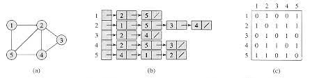
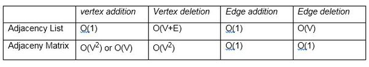

## Graph
* Is a collection of **vertices or nodes** (data and a pointer to next node) that are connected to each other via **edges** to form a network
* The data that can be stored in a node can be an integer, a boolean, a hash map or your own custom objects
* A pair(x,y) is called an **edge**, which indicates that vertex x is connected to vertex y. 
* An edge may contain weight/cost, showing how much cost is required to traverse from vertex x to y.
* Linked list too is a type of graph

### Types of Graphs
#### Directed Graph:
You can traverse only in one direction i.e. if you're at vertex x, you can move from x->y, but not from y->x
#### Undirected Graph:
You can traverse in both the directions. If there's a pair(x,y), you can either traverse from x to y or vice versa

### Terminologies
#### Degree of vertex:
Total number of edges connected to a vertex
* In-degree - number of incoming edges 
* Out-degree - number of outgoing edges

#### Connected Component
A group of nodes that are connected by edges

#### Cyclic Graph
A path in the edge that visits the same node multiple times

### Representation:
#### Adjacency List
* 2D integer array or array of linked list used to store edges between two nodes
* The size of the list is equal to the number of nodes
* Nodes numbered from 0 to n-1
* graph[i] will have all the outgoing edges from the ith node
* Ex: [[1],[2],[0,3],[]]

#### Array of edges
* Nodes numbered from 0 to n-1
* It's an array where graph[i]=[x,y], which indicates that there is an edge from x to y
* Ex: edges = [[0, 1], [1, 2], [2, 0], [2, 3]]

#### Adjacency Matrix
* Nodes numbered from 0 to n-1 
* 2D matrix of size n x n
* If graph[i][j] == 1, that means there is an outgoing edge from node i to node j
* Ex: [[0,1,0,0],[0,0,1,0],[1,0,0,1],[0,0,0,0]]

    

#### Comparison
* If we have to do frequent modification of vertices, then we can use adjacency list
* If we are dealing majorly in edges, adjacency matrix is a better choice

#### Traversal Techniques
* [Breadth First Search](BreadthFirstSearch.java)
* [Depth First Search](DepthFirstSearch.java)

#### Problems
* [Number of connected components in an undirected graph](ConnectedComponentsInUndirectedGraph.java)
* [Check cycle in a graph](CheckCycleInGraph.java)