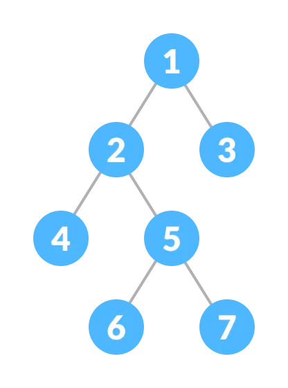

##Tree
* Type of graph
* Definition:
  * Is a directed graph. 
  * Has one connected component. That means all nodes are connected.
  * Acyclic i.e., there are no cycles.
  * One node has an in-degree of zero, called the root. All other nodes have an in-degree of one.
* Tree implementation use cases - file systems, a comment thread, company's org chart

####Leaf Node
Node having no children
#####Depth of a tree
Distance from the root node. The root has a depth of zero. Every child has a depth of parentsDepth+1

###Binary Tree
* All nodes have an outdegree of at most two
* Parents of binary tree refers to left child and right child
* Structure of binary tree
````
class TreeNode {
    int val;
    TreeNode left;
    TreeNode right;
    TreeNode (int val) {
        this.val = val;
    }
}
````

###Depth First Search (DFS)
* Traverse in one direction until reaching the leaf node, and only move to the other direction once we have explored all the nodes in the first direction.
* Implemented using a recursion or a stack

````
public void dfs(Node node) {
    if (node == null) {
        return;
    }

    dfs(node.left);
    dfs(node.right);
}
````

####Preorder Traversal
* Before moving onto the children node, the logic is worked upon the current node
* From the below binary tree, the preorder traversal would be -> 1,2,4,5,6,7,3
* Logic is before the children nodes

  
````
public void preorderDfs(Node node) {
    if (node == null) {
      return;
    }

    System.out.println(node.val);
    preorderDfs(node.left);
    preorderDfs(node.right);
}
````
###Inorder Traversal
* First recursively call the left child, then perform logic on the current node, then recursively call the right child
* The inorder traversal would be -> 4,2,6,5,7,1,3
* Logic is in between the children nodes
````
public void inorderDfs(Node node) {
    if (node == null) {
        return;
    }

    inorderDfs(node.left);
    System.out.println(node.val);
    inorderDfs(node.right);
}
````
####Postorder Traversal
* Recursively call on the children first and then perform logic on the current node.
* The postorder traversal would be -> 4,6,7,5,2,3,1
* Logic is after the children nodes
````
public void postorderDfs(Node node) {
    if (node == null) {
        return;
    }

    postorderDfs(node.left);
    postorderDfs(node.right);
    System.out.println(node.val);
}
````